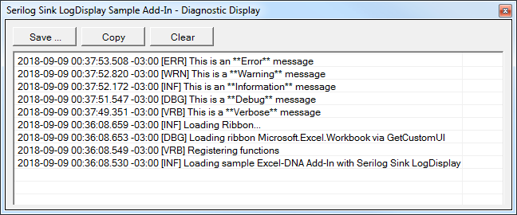
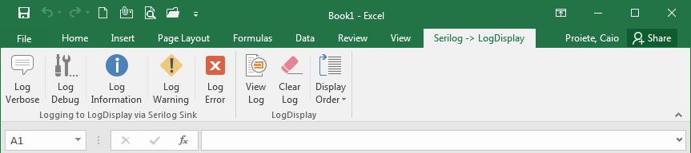
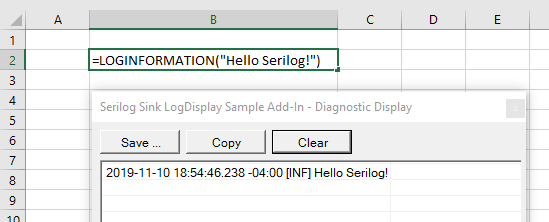

# Serilog.Sinks.ExcelDnaLogDisplay [](https://www.nuget.org/packages/Serilog.Sinks.ExcelDnaLogDisplay/) [](http://stackoverflow.com/questions/tagged/serilog) [](http://stackoverflow.com/questions/tagged/excel-dna)

Writes [Serilog](https://serilog.net) events to [Excel-DNA](https://excel-dna.net) `LogDisplay`.



## Give a Star! :star:

If you like or are using this project please give it a star. Thanks!

## Getting started

Install the [Serilog.Sinks.ExcelDnaLogDisplay](https://www.nuget.org/packages/Serilog.Sinks.ExcelDnaLogDisplay/) package from NuGet:

```powershell
Install-Package Serilog.Sinks.ExcelDnaLogDisplay
```

To configure the sink in C# code, call `WriteTo.ExcelDnaLogDisplay()` during logger configuration:

```csharp
var log = new LoggerConfiguration()
    .WriteTo.ExcelDnaLogDisplay(displayOrder: DisplayOrder.NewestFirst)
    .CreateLogger();
```
### Example of an Excel-DNA add-in using Serilog with this sink

In the [sample](sample/) folder, there's an example of an Excel-DNA add-in that uses Serilog for logging to the `LogDisplay` of Excel-DNA using this sink, from different contexts, suchs as from an `ExcelRibbon` control event handler as well from an `ExcelFunction`:

[](sample/SampleAddIn/Ribbon.cs)

[](sample/SampleAddIn/Functions.cs)

### XML `<appSettings>` configuration

To use the Excel-DNA LogDisplay sink with the [Serilog.Settings.AppSettings](https://github.com/serilog/serilog-settings-appsettings) package, first install that package if you haven't already done so:

```powershell
Install-Package Serilog.Settings.AppSettings
```

Instead of configuring the logger in code, call `ReadFrom.AppSettings()`:

```csharp
var log = new LoggerConfiguration()
    .ReadFrom.AppSettings()
    .CreateLogger();
```

In your Excel-DNA Add-In's `App.config`, specify the Excel-DNA LogDisplay sink assembly under the `<appSettings>` node:

```xml
<configuration>
  <appSettings>
    <add key="serilog:using:ExcelDnaLogDisplay" value="Serilog.Sinks.ExcelDnaLogDisplay" />
    <add key="serilog:write-to:ExcelDnaLogDisplay" />
```

The parameters that can be set through the `serilog:write-to:ExcelDnaLogDisplay` keys are the method parameters accepted by the `WriteTo.ExcelDnaLogDisplay()` configuration method. This means, for example, that the `displayOrder` parameter can be set with:

```xml
    <add key="serilog:write-to:ExcelDnaLogDisplay.displayOrder" value="NewestFirst" />
```

### Controlling event formatting

The Excel-DNA LogDisplay sink creates events in a fixed text format by default:

```
2018-09-07 09:02:17.148 -03:00 [INF] HTTP GET / responded 200 in 1994 ms
```

The format is controlled using an _output template_, which the Excel-DNA LogDisplay sink configuration method accepts as an `outputTemplate` parameter.

The default format above corresponds to an output template like:

```csharp
  .WriteTo.ExcelDnaLogDisplay(
    outputTemplate: "{Timestamp:yyyy-MM-dd HH:mm:ss.fff zzz} [{Level:u3}] {Message:lj}{NewLine}{Exception}")
```

##### JSON event formatting

To write events to the Excel-DNA LogDisplay in an alternative format such as [JSON](https://github.com/serilog/serilog-formatting-compact), pass an `ITextFormatter` as the first argument:

```csharp
    // Install-Package Serilog.Formatting.Compact
    .WriteTo.ExcelDnaLogDisplay(new CompactJsonFormatter())
```

### Auditing

The Excel-DNA LogDisplay sink can operate as an audit sink through `AuditTo`:

```csharp
    .AuditTo.ExcelDnaLogDisplay(displayOrder: DisplayOrder.NewestFirst)
```

### Excel-DNA configuration for packing with `ExcelDnaPack`

In order for the Excel-DNA LogDisplay sink to work from an add-in that was packaged using the ExcelDnaPack utility, you need to include references to `Serilog.dll` and `Serilog.Sinks.ExcelDnaLogDisplay.dll` in the `.dna` file of the add-in:

```xml
<DnaLibrary Name="My Add-In" RuntimeVersion="v4.0">
  <ExternalLibrary Path="MyAddIn.dll" ExplicitExports="false" LoadFromBytes="true" Pack="true" />

  <Reference Path="Serilog.dll" Pack="true" />
  <Reference Path="Serilog.Sinks.ExcelDnaLogDisplay.dll" Pack="true" />
```

## Release History

Click on the [Releases](https://github.com/augustoproiete/serilog-sinks-exceldnalogdisplay/releases) tab on GitHub.

---

_Copyright &copy; 2018-2020 C. Augusto Proiete & Contributors - Provided under the [Apache License, Version 2.0](http://apache.org/licenses/LICENSE-2.0.html)._
